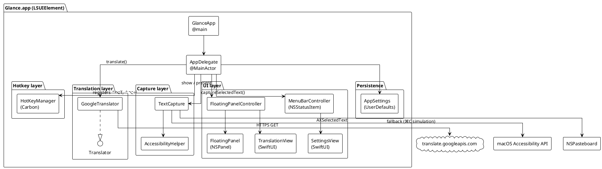
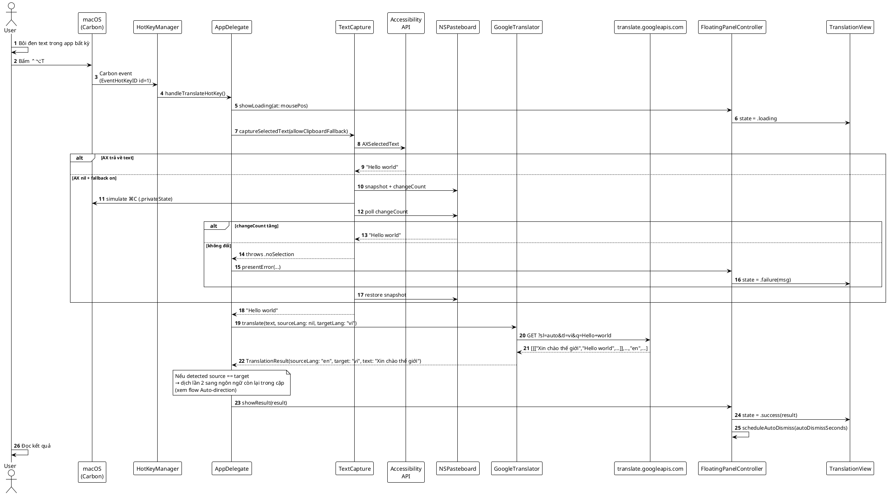
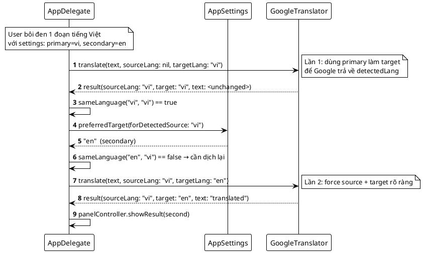
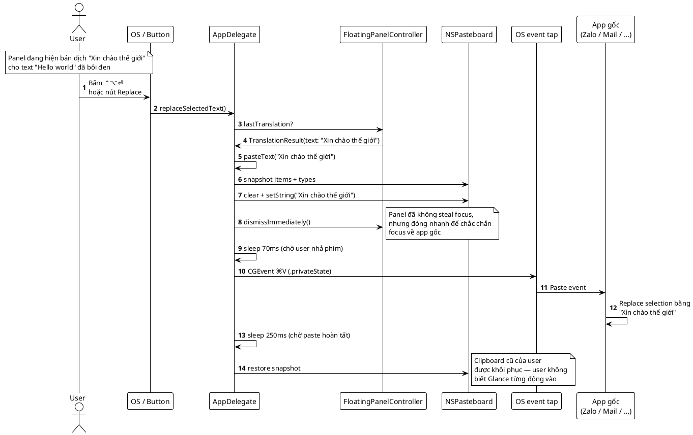
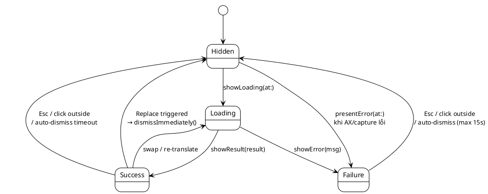

# Glance — Tech Spec

> **Một cái liếc — hiểu mọi ngôn ngữ.**
> Dịch tức thì trên macOS bằng phím tắt, không rời app hiện tại.

---

## 1. Tổng quan

Glance là một macOS menu bar app (LSUIElement, không Dock icon) cung cấp 2 hành động global:

| Hotkey | Hành động |
|---|---|
| `⌃⌥T` | Dịch văn bản đang bôi đen → hiện floating panel cạnh con trỏ |
| `⌃⌥⏎` | Thay đoạn đang bôi đen bằng bản dịch gần nhất |

Engine mặc định: **Google Translate** (free `gtx` endpoint, không cần API key). Toàn bộ logic chạy **on-device**; không có backend riêng. Văn bản chỉ rời máy khi gửi đến Google.

---

## 2. Sơ đồ kiến trúc tổng



---

## 3. Layer chi tiết

### 3.1 Hotkey layer — `HotKeyManager`

Singleton bọc Carbon `RegisterEventHotKey`.

- Một `InstallEventHandler` shared cho cả app (lazy install ở lần register đầu).
- Mỗi hotkey có ID duy nhất; handler dispatch theo `EventHotKeyID.id`.
- Hotkey hoạt động kể cả khi app KHÔNG có focus — đó là toàn bộ điểm.

**Nhược điểm cần biết**: Carbon Event Manager là API legacy nhưng vẫn được Apple support. Khi đổi sang Swift 6 strict concurrency có thể cần thêm `@MainActor` annotation.

### 3.2 Capture layer — `TextCapture`

Hai bước theo thứ tự:

1. **Accessibility API** (`AXSelectedTextAttribute` trên focused element). Hoạt động với Safari, TextEdit, Mail, Notes, Xcode, Pages…
2. **Clipboard fallback** (chỉ khi setting `allowClipboardFallback = true`). Hoạt động với Zalo, Slack, VS Code, Chrome, Discord… (đa số app Electron/Chromium).

**An toàn clipboard**:
- Snapshot toàn bộ items + `changeCount` TRƯỚC khi post `⌘C`
- Dùng `CGEventSource(stateID: .privateState)` để OS bỏ qua ⌃⌥ user đang giữ
- **CHỈ** đọc clipboard nếu `changeCount` đã thay đổi (= có copy mới thực sự). Nếu không đổi → trả nil, KHÔNG bao giờ đọc clipboard cũ.
- Restore clipboard ngay sau khi đọc.

### 3.3 Translation layer

```swift
protocol Translator {
    var engine: TranslationEngine { get }
    func translate(
        text: String,
        sourceLanguage: String?,   // nil = auto-detect
        targetLanguage: String
    ) async throws -> TranslationResult
}
```

Hiện chỉ có `GoogleTranslator` (gọi `https://translate.googleapis.com/translate_a/single?client=gtx&sl=...&tl=...&dt=t&q=...`). Endpoint trả về mảng JSON, ta nối các segment `[0]` và đọc detected language ở index `[2]`.

OpenAI / Anthropic sẽ là implement mới của `Translator`, plug-in qua dependency injection ở `AppDelegate`.

### 3.4 UI layer

**`FloatingPanel`** subclass `NSPanel` với:
- `styleMask = [.nonactivatingPanel, .borderless, .fullSizeContentView]`
- `canBecomeKey = false` ⇒ panel KHÔNG steal focus từ app đang dùng
- `level = .floating`
- `collectionBehavior = [.canJoinAllSpaces, .fullScreenAuxiliary, .transient]`

**`FloatingPanelController`** quản lý lifecycle: present, show loading/result/error, position clamp vào màn hình, auto-dismiss, global dismiss monitor (click ra ngoài / Esc).

**`TranslationView`** SwiftUI: header pills + swap, content (loading/text/error), actions bar (Replace filled accent / Copy / Dismiss).

### 3.5 Persistence — `AppSettings`

`@MainActor` ObservableObject singleton, store trong `UserDefaults`:

| Key | Type | Default | Mô tả |
|---|---|---|---|
| `glance.engine` | `TranslationEngine` | `.google` | Engine dịch |
| `glance.primaryLanguage` | `String` | `vi` | Ngôn ngữ chính của user |
| `glance.secondaryLanguage` | `String` | `en` | Ngôn ngữ phụ |
| `glance.saveHistory` | `Bool` | `false` | Lưu lịch sử (chưa implement) |
| `glance.uiLanguage` | `String` | `vi` | UI Vietnamese/English |
| `glance.allowClipboardFallback` | `Bool` | `true` | Cho phép giả lập ⌘C |
| `glance.autoDismissSeconds` | `Int` | `60` | Auto-dismiss timeout (0 = never) |

---

## 4. Flow chính

### 4.1 Flow: Dịch text bôi đen (⌃⌥T)



### 4.2 Flow: Auto-direction (đảo chiều thông minh)



### 4.3 Flow: Replace text bôi đen (⌃⌥⏎ hoặc nút Replace)



### 4.4 State diagram: Floating panel



---

## 5. Tương tác với macOS — quyền & rủi ro

### Quyền Accessibility (`AXIsProcessTrusted`)

Bắt buộc cho:
1. `AXUIElementCopyAttributeValue` đọc `AXSelectedTextAttribute`
2. `CGEvent.post(tap: .cghidEventTap)` để giả lập `⌘C` và `⌘V`

App tự gọi `AXIsProcessTrustedWithOptions(prompt: true)` lúc launch.

### Không cần Screen Recording

Hiện tại MVP không có OCR. Khi thêm Vision `VNRecognizeTextRequest` sẽ cần Screen Recording.

### Không App Sandbox

`com.apple.security.app-sandbox = false` để có quyền:
- Đọc Accessibility tree của process khác
- Đăng ký global hotkey
- Đọc/ghi `NSPasteboard.general`

Nghĩa là app KHÔNG submit được lên Mac App Store. Distribute qua DMG + Apple Developer ID notarization.

---

## 6. Hotkey table

| Hotkey | Scope | Hành động |
|---|---|---|
| `⌃⌥T` | Global | Translate text đang bôi đen |
| `⌃⌥⏎` | Global | Replace text đang bôi đen bằng `lastTranslation` |
| `Esc` | Khi panel có focus tạm thời | Đóng panel |
| `⌘,` | Khi menu mở | Mở Settings |
| `⌘Q` | Khi menu mở | Thoát app |

**Tại sao `⌃⌥⏎` cho Replace**: cùng modifier chord với `⌃⌥T`, ngón tay đã sẵn ở đó, chỉ đổi T → Enter. Muscle memory ngắn nhất.

---

## 7. Quyết định thiết kế (ADR-style)

### ADR-1: Dùng Carbon `RegisterEventHotKey` thay vì `NSEvent.addGlobalMonitor`

- `addGlobalMonitor` chỉ observe, KHÔNG suppress được phím → ⌃⌥T sẽ leak ký tự "†" (Option+T) vào app đang focus.
- `RegisterEventHotKey` suppress đúng cách. Carbon vẫn được Apple support.

### ADR-2: Clipboard fallback dùng strict `changeCount` check

- Vấn đề thực tế: nhiều app Electron không phơi bày `AXSelectedTextAttribute`.
- Vấn đề privacy ban đầu: code cũ rớt về clipboard cũ → lộ data nhạy cảm.
- Fix: chỉ đọc clipboard nếu `changeCount` tăng. Snapshot+restore an toàn.

### ADR-3: Replace dùng `⌘V` simulation thay vì AX `setValue`

- AX `setValue(kAXSelectedTextAttribute)` chỉ hoạt động với app có AX text role — y hệt set Electron không hỗ trợ.
- `⌘V` simulation hoạt động với mọi text field — universal.
- Phải snapshot + restore clipboard để giữ trải nghiệm trong sạch.

### ADR-4: `NSPanel` nonactivating thay vì `NSWindow`

- Panel hiện ra KHÔNG được steal focus → khi user bấm Replace, focus vẫn ở app gốc, `⌘V` vào đúng chỗ.
- Tradeoff: SwiftUI `.keyboardShortcut` chỉ hoạt động khi window là key. Vì panel không key → Replace shortcut phải đi qua global Carbon hotkey, không phải SwiftUI shortcut.

### ADR-5: XcodeGen thay vì commit `.xcodeproj`

- `project.yml` đọc được, diff được, không bị merge conflict trên `.pbxproj`.
- Onboarding: `brew install xcodegen && xcodegen generate`.

---

## 8. Lộ trình mở rộng

| Feature | Layer ảnh hưởng | Ghi chú |
|---|---|---|
| OpenAI / Anthropic engine | `Translator` impl mới + Keychain | API key user nhập, store Keychain, dropdown engine ở Settings |
| Streaming SSE | `TranslationView` (incremental update) + `Translator` (AsyncSequence) | Cho AI engine |
| OCR | Vision framework + Screen Recording permission | Hotkey thứ 3: ⌃⌥O = chụp vùng + OCR + dịch |
| Local history | SQLite ở `~/Library/Application Support/Glance` | Bật/tắt theo `saveHistory` |
| Custom hotkey | UI ghi `keyCode` + `modifiers` vào Settings | `HotKeyManager.unregister(id)` + register lại |
| Context-aware prompt | Bổ sung field "context" vào `Translator.translate(...)` | AI engine dùng để adjust tone |
| Sparkle auto-update | Sparkle SDK + Apple Developer ID + notarization | Trước khi public release |

---

## 9. Render PlantUML

Các block `plantuml` trong tài liệu này render được bằng:

- VS Code extension: `jebbs.plantuml`
- IntelliJ / Xcode plugin
- Online: https://www.plantuml.com/plantuml/uml

Hoặc local CLI:

```bash
brew install plantuml
plantuml -tsvg docs/TECH_SPEC.md
```
